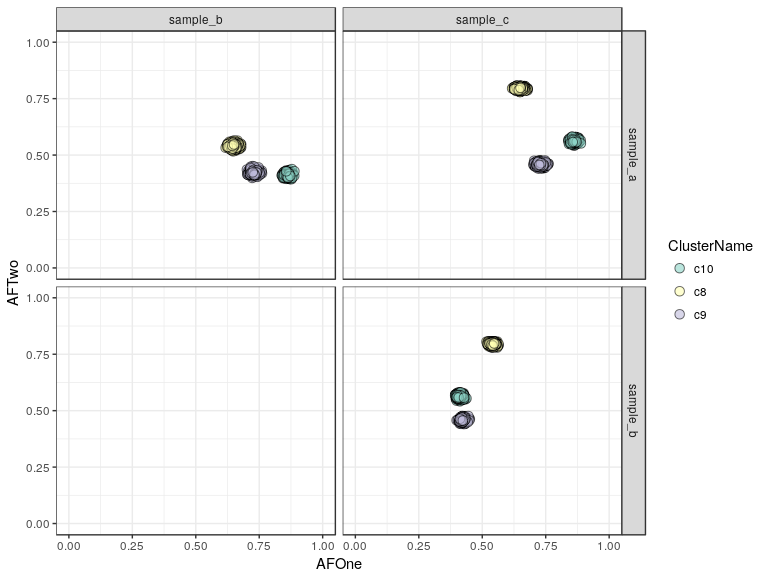
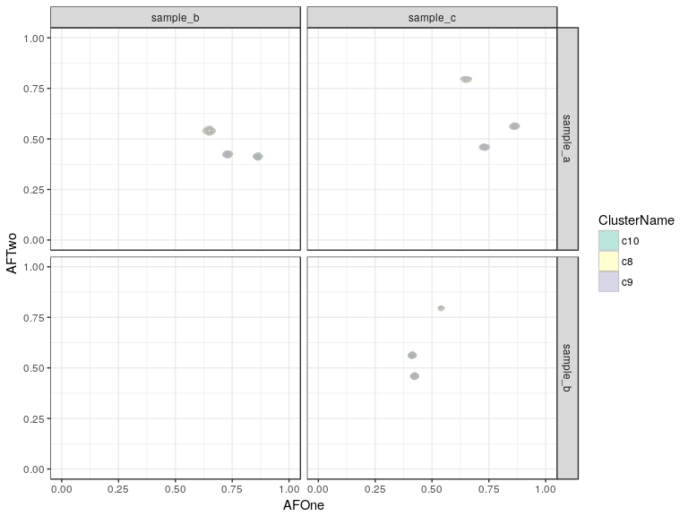
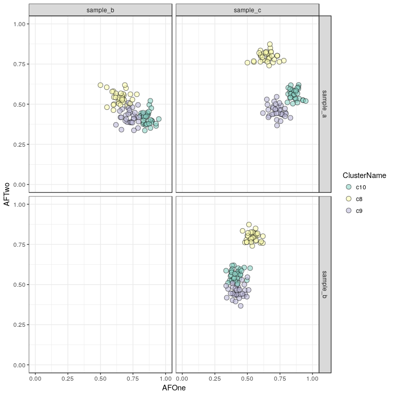
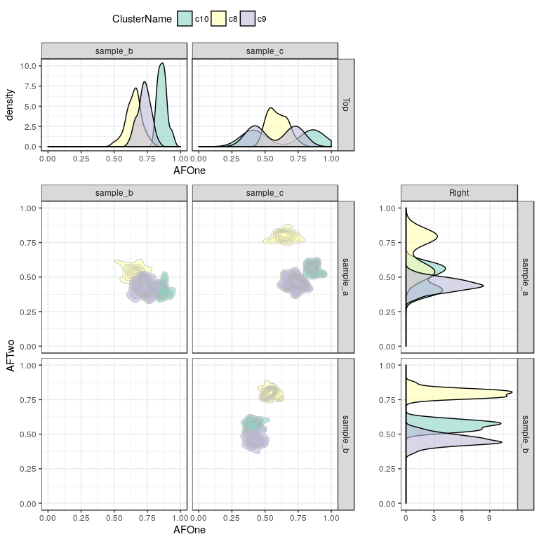
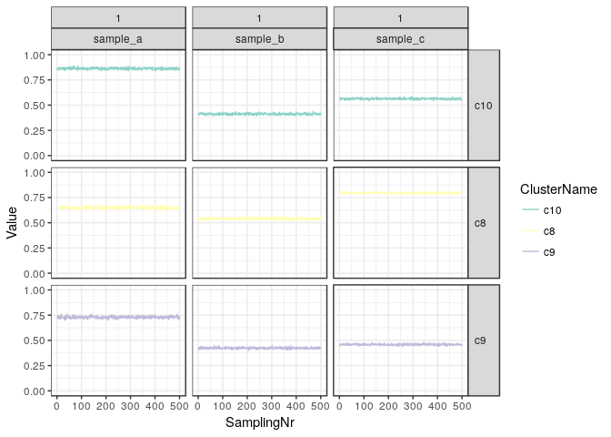

Introduction
============

This package provides helper function to create models for SNV
clustering using empirical bayesian methods with the rjags package.

Installation
============

Use devtools to pull the package from GitHub like so:

    install.packages("devtools") # If you do not have it yet
    require(devtools)
    install_github("PaulPyl/JagsCluster")

Creating a Model
================

A valid JAGS model can be created with the `createJagsModel` function,
which takes as an input parameter the number of samples (`nSamples`) and
outputs a text definition of a JAGS model for a series with `nSamples`
many samples in it.

    require(JagsCluster)

    ## Loading required package: JagsCluster

    ## Loading required package: rjags

    ## Loading required package: coda

    ## Linked to JAGS 4.2.0

    ## Loaded modules: basemod,bugs

    ## Loading required package: ggplot2

    ## Loading required package: reshape2

    ## Loading required package: cowplot

    ## 
    ## Attaching package: 'cowplot'

    ## The following object is masked from 'package:ggplot2':
    ## 
    ##     ggsave

    theModel <- createJagsModel(nSamples = 3)
    cat(theModel)

    ## model {
    ## # Likelihood:
    ## for( i in 1 : Nsnvs ) {
    ##   clust[i] ~ dcat(cluster.weight[1:Nclust])
    ##   count.1[i] ~ dbin(snv.center.1[i], coverage.1[i])
    ##   snv.center.1[i] <- cluster.center.1[clust[i]]
    ##   count.2[i] ~ dbin(snv.center.2[i], coverage.2[i])
    ##   snv.center.2[i] <- cluster.center.2[clust[i]]
    ##   count.3[i] ~ dbin(snv.center.3[i], coverage.3[i])
    ##   snv.center.3[i] <- cluster.center.3[clust[i]]
    ## }
    ## # Priors:
    ## for ( clustIdx in 1 : Nclust ) {
    ##   cluster.center.1[clustIdx] ~ dunif(0, 1)
    ##   cluster.center.2[clustIdx] ~ dunif(0, 1)
    ##   cluster.center.3[clustIdx] ~ dunif(0, 1)
    ##   delta[clustIdx] ~ dgamma(alpha1, alpha2)
    ##   cluster.weight[clustIdx] <- delta[clustIdx] / sum(delta[])
    ## }
    ## alpha1 ~ dbeta(shape1, shape2)
    ## alpha2 ~ dbeta(shape2, shape2)
    ## }

Input Data format
=================

The input data is expected to be a list with two elements named
`Support` and `Coverage`, each of those is a matrix with `n` rows and
`m` columns where `n` is the number of SNVs and `m` is the number of
samples. Usage of meaningful row and column names is encouraged.

We can simulate some data to demonstrate the modelling functionality:

    sDat <- simulateData(nSamples = 3, nSNVs = 100, nClusters = 3, meanCoverage = c(60, 120, 180))
    lapply(sDat, head)

    ## $Coverage
    ##       sample_a sample_b sample_c
    ## snv_1       63       98      173
    ## snv_2       55      116      189
    ## snv_3       53      113      187
    ## snv_4       61      118      210
    ## snv_5       61      115      168
    ## snv_6       57      124      142
    ## 
    ## $Support
    ##       sample_a sample_b sample_c
    ## snv_1       20       79      129
    ## snv_2       38        6       56
    ## snv_3       49       57       49
    ## snv_4       11       94      146
    ## snv_5       39        9       50
    ## snv_6       57       68       28

Modelling
=========

The model is run by a call to the `clusterSamples` function, giving the
data as input as well as a number of parameters for the clustering
algorith. We will leave them at the default settings for now, eventhough
that will try to fit 10 clusters and we know we simulated only 3.

    clusteringResult <- clusterSamples(sDat)

    ## Compiling model graph
    ##    Resolving undeclared variables
    ##    Allocating nodes
    ## Graph information:
    ##    Observed stochastic nodes: 300
    ##    Unobserved stochastic nodes: 142
    ##    Total graph size: 1119
    ## 
    ## Initializing model

rjags will produce some output including a progress bar of the modelling
process.

Results
=======

Cluster Weights and Allelic Frequencies
---------------------------------------

Let's plot the cluster weights and mean allelic frequencies of the
result:

    plotClusterWeights(clusteringResult) + scale_fill_brewer(palette = "Set3")

In this plot we see three clusters with ~33% Weight (which makes sense
since we simulated 3 clusters of equal size), the other clusters have
weights close to 0.

    plotClusters(clusteringResult, mode = "point") + scale_fill_brewer(palette = "Set3")

    plotClusters(clusteringResult, mode = "density2d") + scale_fill_brewer(palette = "Set3")

The density version of this plot is not very helpful in this case of
simulated data, which are not very noisy at all, this can be more
informative if your clusters show a wide spread or strangely shaped
clouds, to determine the underlying density. If the coverage is lower
the data becomes more noisy and if the number of SNVs is lower the
clusters will also be less well-defined, an example is shown below:

    sDatNoisy <- simulateData(nSamples = 3, nSNVs = 40, nClusters = 3, meanCoverage = c(20, 30, 40))
    clusteringResultNoisy <- clusterSamples(sDatNoisy)

    ## Compiling model graph
    ##    Resolving undeclared variables
    ##    Allocating nodes
    ## Graph information:
    ##    Observed stochastic nodes: 120
    ##    Unobserved stochastic nodes: 82
    ##    Total graph size: 519
    ## 
    ## Initializing model

    cp <- plotClusters(clusteringResultNoisy, mode = "density2d") + scale_fill_brewer(palette = "Set3")
    cp

SNV Cluster assignment Plot
---------------------------

Another way to look at this is to plot the SNVs annotated with the
clusters they were assigned to:

    sp <- plotResultSNVs(clusteringResult, mode = "point") + scale_fill_brewer(palette = "Set3")
    sp

It can be useful to look at this as a density plot, in case too many
points overlap and it is not easy to make out the shape and local
density of the clusters.

    sp <- plotResultSNVs(clusteringResult, mode = "density2d") + scale_fill_brewer(palette = "Set3")
    sp

Here we see our three clusters of simulated SNVs and their respective
allelic frequencies in the three samples.

Sometimes it can be interesting to add marginal distribution densities
to those plots as well:

    addMarginals(sp, scale_fill_brewer(palette = "Set3"))

    ## Scale for 'fill' is already present. Adding another scale for 'fill',
    ## which will replace the existing scale.

JAGS model chain plots
----------------------

A more in-depth look can be had by tracing the actual allele frequencies
of the clusters as they were sampled from the mixture model. Here we
plot only clusters which contain at least 1% of SNVs in the final
estimate.

    plotChains(clusteringResult, minWeight = 0.01) + ylim(0,1) + scale_colour_brewer(palette = "Set3")

We see that the model has converged very well and in all samples the
clusters are very stable in their respective estimated alelle
frequencies. Since this is simulated data we did expect such behaviour
and in real-world examples the clusterin can be much more unstable.
Typically it is advisable to filter the input data strictly and try to
focus on SNVs where there is a lot of evidence, i.e. where the coverage
is high, so that the estimated AFs can be very precise.

If we allow for all clusters to be plotted we see that the clusters with
low weight do not converge at all and are all over the place, this is
not a problem however, since when the clusters contain no data the prior
probability is never updated and so they sample from a uniform
distribution between `0` and `1`, which is expected.

    plotChains(clusteringResult, minWeight = 0) + ylim(0,1) + scale_colour_brewer(palette = "Set3")

